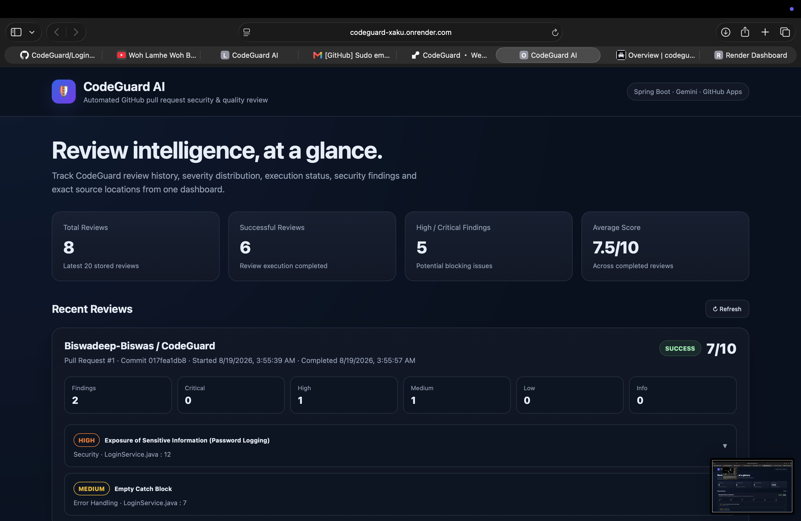
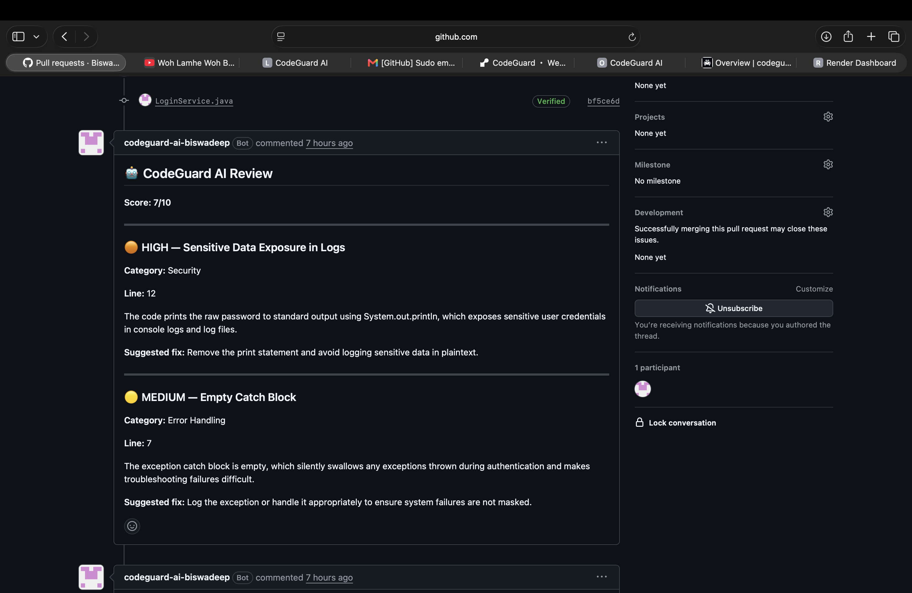
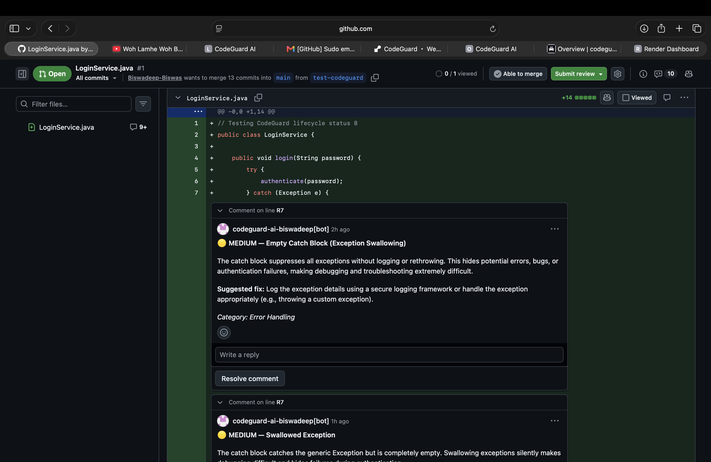
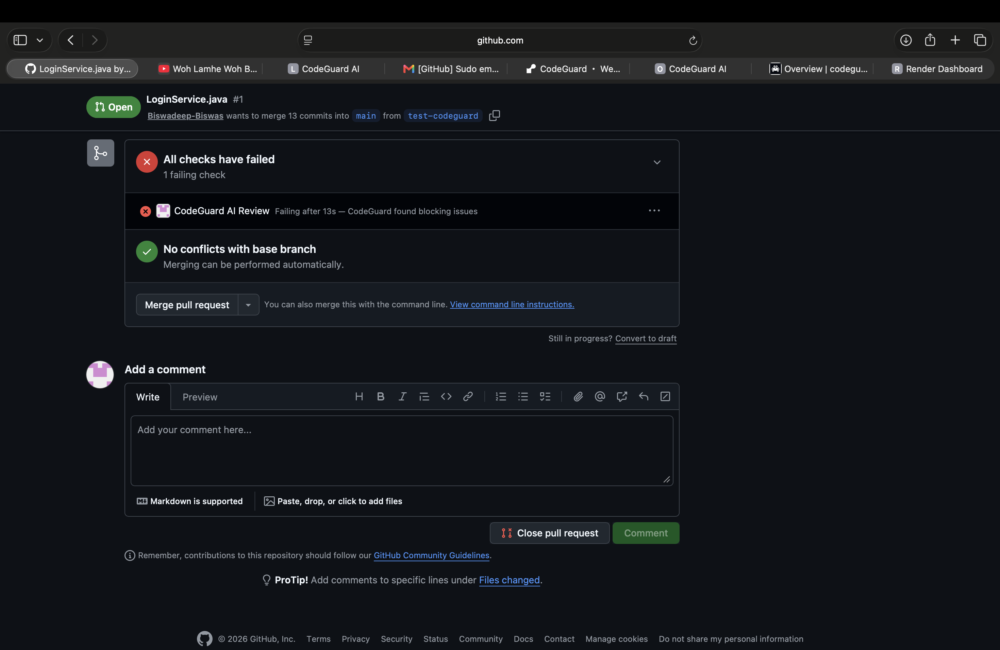
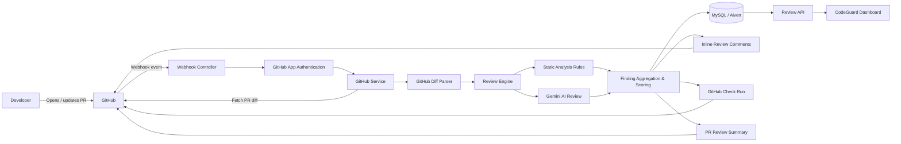

# 🛡️ CodeGuard AI

**AI-powered GitHub pull request reviewer built with Spring Boot, Gemini, GitHub Apps, and MySQL.**

CodeGuard automatically reviews pull requests, analyzes changed code using a combination of deterministic static-analysis rules and AI, posts inline review comments on the exact affected lines, calculates a code-quality score, and reports the result through GitHub Checks.

---

## 💡 Why CodeGuard?

Traditional linters are excellent at detecting predefined patterns, while large language models can reason about broader code context but may produce inconsistent results.

CodeGuard combines both approaches:

- **Deterministic rules** for predictable static-analysis findings
- **Gemini AI** for contextual code-review reasoning
- **Git diff parsing** for accurate source-line mapping
- **Deterministic scoring** for consistent quality evaluation
- **GitHub-native feedback** through inline comments and Check Runs
- **Persistent review history** for tracking results beyond a single pull request

The goal is not simply to generate an AI review, but to build a complete automated pull-request review pipeline.

---

## ✨ Features

- 🤖 AI-powered code review using Google Gemini
- 🔍 Deterministic static-analysis rules
- 💬 Native inline GitHub pull request comments
- 📍 Accurate file and new-line mapping from Git diffs
- 📊 Deterministic code-quality scoring from `0–10`
- 🚦 Severity-aware GitHub Check Runs
- 🔁 Automatic retry handling for temporary AI API failures
- 🗃️ Persistent review history using MySQL
- 🔒 GitHub App authentication
- 🪝 Automatic reviews through GitHub webhooks
- 📈 Web dashboard for review history and statistics
- 🧪 Automated unit testing for core review logic
- ☁️ Cloud deployment

---

## 🖥️ CodeGuard in Action

### Review Dashboard

CodeGuard provides a dashboard for monitoring review history, scores, severity distribution, execution status, and exact source locations.



### AI Review Summary

Every analyzed pull request receives a structured summary containing the overall score, detected issues, severity levels, explanations, and suggested fixes.



### Inline Pull Request Reviews

CodeGuard maps findings back to exact changed lines and posts native GitHub inline review comments.

This makes findings visible directly beside the code that caused them.



### GitHub Checks Integration

CodeGuard creates a GitHub Check Run for every review.

High or critical findings automatically fail the check, allowing serious problems to be surfaced before the pull request is merged.



---

## 🏗️ Architecture



CodeGuard operates as an event-driven GitHub App.

Pull request events trigger the review pipeline, where changed code is normalized and analyzed using both deterministic static-analysis rules and Gemini.

Findings are then deduplicated, scored, persisted, and mapped back to exact source lines before CodeGuard publishes the results through GitHub comments and Check Runs.

---

## 🔄 Review Pipeline

When a pull request is opened or updated:

1. GitHub sends a webhook event to CodeGuard.
2. CodeGuard authenticates using the installed GitHub App.
3. CodeGuard creates an in-progress GitHub Check Run.
4. Changed files and Git patches are fetched through the GitHub REST API.
5. Git diff hunks are converted into exact new-file line numbers.
6. Deterministic static-analysis rules inspect the changed code.
7. Gemini performs a contextual AI-assisted code review.
8. Static and AI findings are combined.
9. Duplicate findings are removed.
10. CodeGuard calculates a deterministic quality score.
11. Findings are posted as inline pull-request comments.
12. A review summary is posted to the pull request.
13. The GitHub Check Run is completed according to finding severity.
14. Review results and lifecycle information are persisted in MySQL.
15. Stored reviews are exposed through the dashboard.

---

## 🧠 Hybrid Review Engine

CodeGuard uses a hybrid review architecture rather than relying entirely on an LLM.

### Deterministic Static Analysis

CodeGuard can run predefined `CodeReviewRule` implementations against changed source code.

These rules provide predictable detection for known programming problems.

### Gemini AI Review

The changed source code is also sent to Gemini for contextual analysis.

The AI reviewer looks for meaningful issues involving:

- functional bugs
- security vulnerabilities
- incorrect exception handling
- performance problems
- maintainability problems
- dangerous programming practices

Purely stylistic preferences are intentionally excluded from the review prompt.

---

## 📦 Structured AI Output

Instead of accepting arbitrary natural-language responses, CodeGuard requests structured JSON from Gemini.

Each finding contains information such as:

```json
{
  "severity": "HIGH",
  "category": "Security",
  "title": "Sensitive Data Exposure in Logs",
  "filePath": "LoginService.java",
  "explanation": "Sensitive credentials are being written to application output.",
  "suggestion": "Remove logging of raw credentials.",
  "line": 12
}
```

Supported severity levels are:

```text
CRITICAL
HIGH
MEDIUM
LOW
INFO
```

Structured responses allow CodeGuard to process AI output programmatically instead of attempting to parse arbitrary prose.

---

## 📍 Accurate Git Diff Line Mapping

GitHub returns pull-request changes as unified diff patches.

Posting an inline comment requires the correct file path and line number from the **new version** of the file.

CodeGuard contains a dedicated `GitHubDiffParser` that reads diff hunk headers and tracks new-file line numbers.

For example, source code is normalized into input such as:

```text
FILE: LoginService.java
NEW LINE 4:     public void login(String password) {
NEW LINE 5:         try {
NEW LINE 6:             authenticate(password);
NEW LINE 7:         } catch (Exception e) {
NEW LINE 8:         }
NEW LINE 9:     }
NEW LINE 10:
NEW LINE 11:     private void authenticate(String password) {
NEW LINE 12:         System.out.println("USER PASSWORD: " + password);
NEW LINE 13:     }
```

Gemini is instructed to:

```text
Use exactly the provided NEW LINE number.

Do not calculate line numbers independently.

filePath must exactly match the value after FILE:.
```

This enables CodeGuard to map AI findings back to GitHub's native inline review API.

---

## 📊 Deterministic Scoring

AI determines what issues exist, but **CodeGuard itself calculates the final review score**.

Every review starts with:

```text
10/10
```

Severity penalties are:

| Severity | Penalty |
|---|---:|
| CRITICAL | -4.0 |
| HIGH | -3.0 |
| MEDIUM | -1.5 |
| LOW | -0.5 |
| INFO | 0 |

The internal scoring implementation uses a 20-point representation so half-point penalties can be handled without floating-point scoring logic.

For example:

```text
Starting score = 10

HIGH finding   = -3.0
MEDIUM finding = -1.5

Final raw score = 5.5
Displayed integer score = 6/10
```

The final score is clamped so it can never fall below zero.

---

## 🔍 Finding Deduplication

Static analysis and Gemini may occasionally identify the same problem.

Before calculating the score, CodeGuard removes basic duplicate findings.

The deduplication key includes:

```text
filePath + lineNumber + normalizedTitle
```

Including the file path prevents findings such as:

```text
LoginService.java:12
```

and

```text
AdminLoginService.java:12
```

from accidentally being treated as the same issue.

---

## 🚦 GitHub Check Policy

CodeGuard translates review severity into a native GitHub Check conclusion.

| Findings | GitHub Check |
|---|---|
| CRITICAL | ❌ Failure |
| HIGH | ❌ Failure |
| MEDIUM | ⚠️ Neutral |
| LOW | ✅ Success |
| INFO | ✅ Success |
| No findings | ✅ Success |

If multiple severities are present, the most serious applicable result wins.

For example:

```text
MEDIUM + HIGH
       ↓
FAILURE
```

The conclusion policy is implemented separately from the GitHub API integration so that it can be tested independently.

---

## 💬 GitHub Review Output

CodeGuard publishes review information in three different ways.

### 1. Inline Comments

Individual findings are posted directly beside affected source lines.

Each comment includes:

- severity
- title
- explanation
- suggested fix
- category

### 2. Pull Request Summary

A summary comment contains:

- review score
- total number of findings
- number of inline comments posted
- finding severity
- finding title
- file path
- line number

### 3. GitHub Check Run

A native GitHub Check displays whether CodeGuard considers the review:

```text
SUCCESS
NEUTRAL
FAILURE
```

This makes CodeGuard part of the pull-request validation workflow rather than only a comment bot.

---

## 🔁 Reliability & Failure Handling

External AI APIs can temporarily become unavailable or rate limited.

CodeGuard automatically retries Gemini requests for temporary failures such as:

```text
HTTP 429 — Too Many Requests

HTTP 503 — Service Unavailable
```

The current retry strategy performs up to:

```text
3 attempts
```

with delays between retries.

Non-retryable failures are surfaced immediately.

---

## 🗃️ Review Lifecycle

A database record is created before the main review process begins.

A review can move through lifecycle states such as:

```text
PROCESSING
     │
     ├──── successful review ────> SUCCESS
     │
     └──── processing failure ───> FAILED
```

This makes operational failures distinguishable from legitimate reviews containing code-quality problems.

For example:

```text
Review lifecycle: SUCCESS
GitHub Check: FAILURE
```

is valid.

It means CodeGuard successfully completed its job but found blocking issues in the source code.

---

## 🗄️ Persistence

Review history is persisted using Spring Data JPA and MySQL.

A stored review contains information such as:

```text
Repository owner
Repository name
Pull request number
Commit SHA
Review score
Lifecycle status
Creation time
Failure message
Findings
```

Individual findings store information such as:

```text
Severity
Category
Title
Explanation
Suggested fix
File path
Line number
```

Reviews are uniquely associated with a repository, pull request, and commit so the same successful commit does not need to be reviewed repeatedly.

---

## 📈 Dashboard

CodeGuard includes a lightweight web dashboard for viewing historical review information.

The dashboard currently displays:

- total reviews
- successful reviews
- average score
- total findings
- high/critical findings
- repository information
- pull request number
- commit SHA
- review lifecycle status
- severity distribution
- finding file paths
- exact line numbers
- explanations
- suggested fixes

The dashboard consumes review information from the CodeGuard backend API.

---

## 🧪 Automated Testing

Core review behavior is covered by automated unit tests.

Tests currently cover important behavior including:

- perfect score when no findings exist
- HIGH severity scoring
- combined HIGH + MEDIUM scoring
- score lower-bound protection
- duplicate finding removal
- same finding in different files
- Git diff new-line mapping
- deleted-line handling
- multiple diff hunks
- blank patch handling
- SUCCESS conclusion
- NEUTRAL conclusion
- FAILURE conclusion
- severity precedence
- case-insensitive severity handling

Run the complete test suite with:

```bash
./mvnw clean test
```

---

## 🛠️ Tech Stack

### Backend

- Java
- Spring Boot
- Spring Data JPA
- Hibernate
- Maven

### Artificial Intelligence

- Google Gemini API
- Structured JSON responses

### GitHub Integration

- GitHub Apps
- GitHub REST API
- GitHub Webhooks
- GitHub Pull Request Review API
- GitHub Checks API

### Database

- MySQL
- Aiven

### Frontend

- HTML
- CSS
- JavaScript

### Deployment

- Docker
- Render

### Testing

- JUnit 5
- Mockito
- Spring Boot Test

---

## 📂 Project Structure

```text
codeguard/
│
├── docs/
│   └── images/
│       ├── dashboard.png
│       ├── github-check.png
│       ├── inline-review.png
│       └── review-summary.png
│
├── src/
│   ├── main/
│   │   ├── java/
│   │   │   └── com/codeguard/codeguard/
│   │   │       ├── controller/
│   │   │       ├── entity/
│   │   │       ├── exception/
│   │   │       ├── model/
│   │   │       ├── repository/
│   │   │       ├── rule/
│   │   │       └── service/
│   │   │
│   │   └── resources/
│   │       └── static/
│   │           └── index.html
│   │
│   └── test/
│       └── java/
│           └── com/codeguard/codeguard/
│               └── service/
│
├── pom.xml
├── mvnw
├── mvnw.cmd
└── README.md
```

---

## 🔐 Configuration & Security

CodeGuard requires credentials for external services.

These include:

```text
GitHub App ID
GitHub App installation credentials
GitHub App private key
GitHub webhook secret
Gemini API key
MySQL connection credentials
```

Sensitive credentials must be provided through environment variables or secure deployment configuration.

**Secrets and private keys must never be committed to Git.**

Example configuration concept:

```properties
github.app.id=${GITHUB_APP_ID}
github.webhook.secret=${GITHUB_WEBHOOK_SECRET}
gemini.api.key=${GEMINI_API_KEY}
```

Database credentials should follow the same environment-variable approach.

---

## ☁️ Deployment Architecture

The production version of CodeGuard uses cloud-hosted components:

```text
GitHub
   │
   │ Webhooks / REST API
   ▼
CodeGuard
Spring Boot
Render
   │
   ├──────────────► Gemini API
   │
   ▼
Aiven MySQL
```

The Spring Boot application listens on the platform-provided HTTP port and communicates with the external MySQL database over an SSL-enabled connection.

---

## 🛡️ Security Considerations

CodeGuard handles several security-sensitive components.

Important practices include:

- GitHub App private keys are not stored in source control
- API credentials are supplied through environment configuration
- passwords and secrets should never appear in application logs
- webhook requests should be validated before processing
- GitHub installation tokens are generated dynamically
- AI output is constrained using a structured response schema
- review failures are tracked rather than silently ignored

---

## 🗺️ Future Improvements

Potential future improvements include:

- support for additional programming languages
- repository-specific review configuration
- configurable severity thresholds
- configurable scoring policies
- semantic finding deduplication
- dashboard filtering and search
- historical code-quality graphs
- additional deterministic static-analysis rules
- review analytics
- GitHub installation management
- asynchronous job queues for larger workloads
- review batching for very large pull requests
- caching and API usage optimization

---

## 🎯 Project Goals

CodeGuard was built to explore several real software-engineering problems in one project:

- backend service architecture
- third-party API integration
- GitHub App authentication
- webhook-driven systems
- AI integration
- structured LLM output
- diff parsing
- database persistence
- reliability and retry handling
- automated testing
- cloud deployment
- frontend monitoring

The project demonstrates how an AI capability can be integrated into a larger production-style workflow rather than used as a standalone API call.

---

## 👨‍💻 Author

**Biswadeep Biswas**

Built as a software engineering project exploring AI-assisted code review, GitHub automation, backend architecture, reliability, testing, and production deployment.